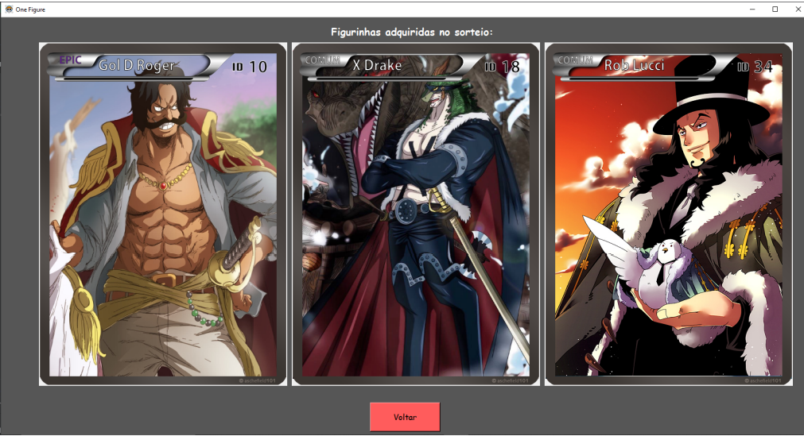

# OneFigure - Sockets

Trabalho prático da disciplina de Sistemas Distribuídos e Paralelos da 🏫 Universidade Federal de Viçosa - Campus Florestal. 

Este trabalho teve como objetivo desenvolver um sistema de figurinhas de nossa escolha, neste caso do anime One Piece, usando API de Soquetes (Sockets) para comunicar entre o Cliente e o Servidor usando XML como formato de mensagem. 

Dentre as funcionalidades do sistema temos:

- Criar e entrar na conta
- Sorteio de figurinhas pelo login diário
- Comprar, vender e visualizar figurinhas
- Anunciar, ver e trocar figurinhas

### 💻 Interface 

Abaixo temos um exemplo de umas das telas do sistema, onde o usuário ganhou figurinhas através do compra. 




********************************************


## 🚀 Começando

O sistema foi desenvolvido em duas partes, a primeira o Servidor e a segunda o Cliente que conta com interface de texto com interação através do terminal e uma interface gráfica, onde o cliente pode interagir através de botões. 

Para obter uma cópia deste projeto:

```shell
git clone https://github.com/adrianomqsmts/CCF355-TP03
cd exemplo
```

Para iniciar o servidor:

```shell
 python Server\main.py
```

Para iniciar o Cliente padrão pelo terminal:

```shell
 python Client\main.py
```

Para iniciar o Cliente com interface Gráfica:

```shell
 python Client\interface.py
```

### 📋 Pré-requisitos

As bibliotecas usadas neste projeto podem ser encontradas no arquivo "requirements.txt"

```shell
pip install -r requirements.txt 
```

## 🛠️ Construído com

Ferramentas, linguagens e outras tecnologias usadas no desenvolvimento deste sistema.

* [PyCharm](https://www.jetbrains.com/pycharm/) - Ambiente de Desenvolvimento
* [Git](https://git-scm.com/) - Controle de Versões
* [MySQL](https://dev.mysql.com/doc/) - Banco de Dados
* [MySQL Workbench](https://dev.mysql.com/doc/workbench/en/) - Ferramenta de Gráfica de Banco de Dados
* [TKinter](https://docs.python.org/3/library/tkinter.html) - Biblioteca de Interface Python

## ✒️ Autores

* **Desenvolvedor** - *Código e Documentação* - [Adriano](https://github.com/adrianomqsmts)
* **Desenvolvedor** - *Código e Documentação* - [Eduardo](https://github.com/eduardovbe)

## 📄 Licença

Este projeto está sob a licença MIT License - veja o arquivo [LICENSE.md](https://github.com/adrianomqsmts/OneFigure-Sockets/blob/master/LICENSE) para detalhes.

---
